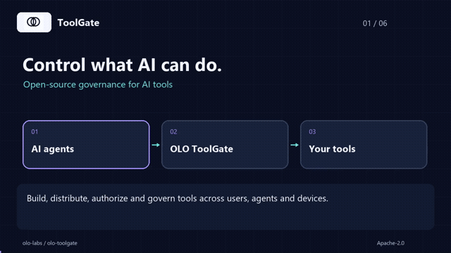
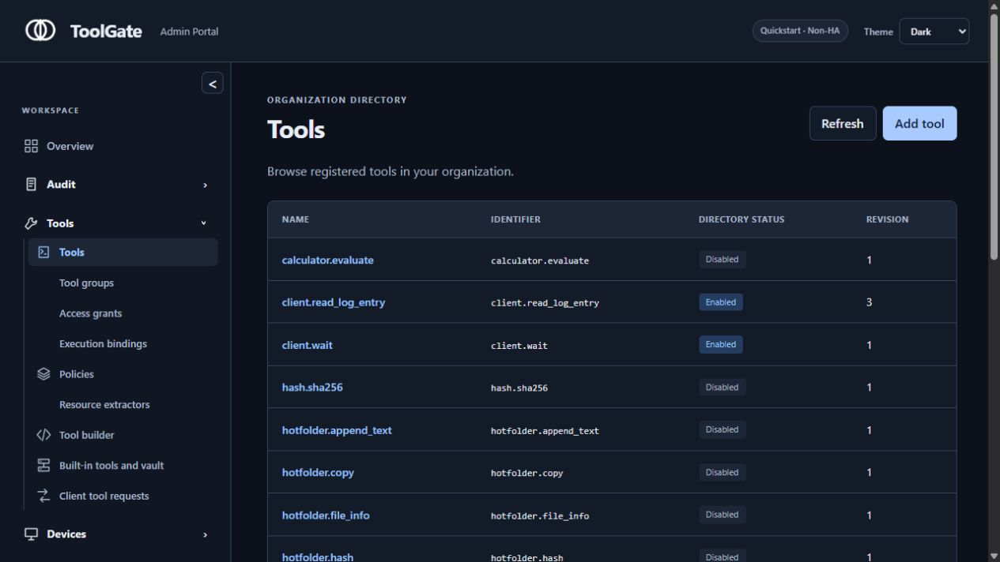
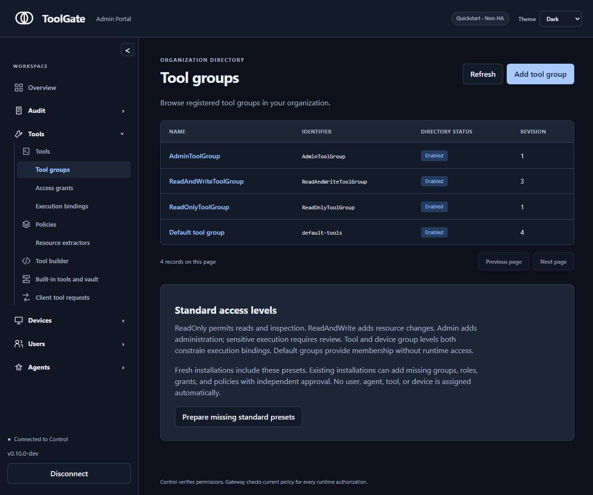
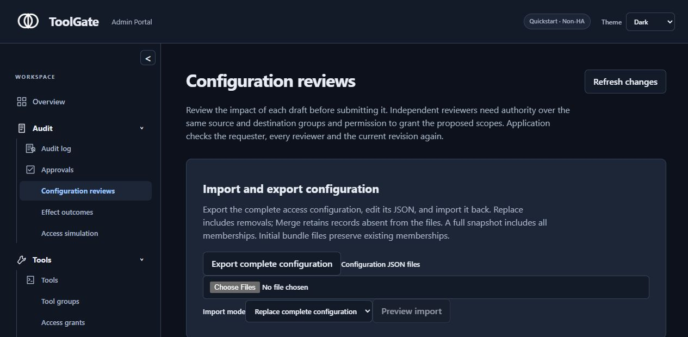

# OLO ToolGate

> **Control what AI can do.**

OLO ToolGate is an open-source control plane for **building, distributing,
authorizing, and governing AI tools** across users, agents, devices, and resources.

[](https://github.com/olo-labs/olo-toolgate/raw/refs/heads/main/docs/media/toolgate-overview.mp4)

**[Watch the video (36 seconds, MP4)](https://github.com/olo-labs/olo-toolgate/raw/refs/heads/main/docs/media/toolgate-overview.mp4)**
· [Read the transcript](docs/media/README.md)
· [Try Quickstart](docs/getting-started/one-minute-quickstart.md)
· [Find a good first issue](https://github.com/olo-labs/olo-toolgate/issues?q=is%3Aissue%20is%3Aopen%20label%3A%22good%20first%20issue%22)

The captioned overview explains an agent's request, group-based access, policy
decisions, and device status. It plays without sound; the animation above is a preview.

## Console snapshots

Captured from the running local **0.10.0-dev** console on October 10, 2026.
The enabled/disabled states shown are the local demo's current configuration.

<details>
<summary>Tool directory — registered capabilities and their current status</summary>



</details>

<details>
<summary>Tool Groups — ReadOnly, ReadAndWrite, Admin and the default group</summary>



</details>

<details>
<summary>Configuration reviews — complete export, import modes and preview</summary>



**Merge** keeps existing records that are absent from the import file and updates records that appear in both. For example, if the live configuration has tools A, B, C and the import file contains only B (modified) and D (new), Merge produces A, B (updated), C, D.

**Replace** removes every existing record not present in the import file. With the same starting set A, B, C and import file B (modified), D, Replace produces B (updated), D — tools A and C are deleted.

> Passwords, private keys and live audit/job state are never included in the exported file. Each import mode supports [independent reviews and revision-conflict guidance](docs/enterprise-access-control/operations.md) before changes take effect.

</details>

The enterprise intermediary version uses group-only grants and current Control
checks for discovery, protected effects and saved results. Unknown verified Users
start disabled in the default Team; default groups grant no access. Agents have a
separate menu and inherit capabilities through Agent Groups. Independent reviewers
approve configuration and operation requests. See [implementation evidence and
remaining acceptance work](docs/enterprise-access-control/implementation-status.md)
and [migration/recovery operations](docs/enterprise-access-control/operations.md).

Run `python tools/enterprise/finish.py` for sequential completion checks, or
`--only NAME` to rerun a failing gate. The runner preserves logs, distinguishes
partial runs and generates the 96-case acceptance evidence; it uses isolated
fixtures and preserves existing debug data.


The current Clients table combines registered devices and pending requests, with device names, registered users and detail tooltips. Enable/Disable and Approve/Deapprove are independent; approval may be timed or explicitly unlimited. Quickstart separately registers the fixed executor, HotFolder and REST forwarding.

See [Device registry and tool-call controls](docs/control-plane/device-registry.md).

The [one-container Quickstart](docs/getting-started/one-minute-quickstart.md)
now combines Gateway, Control and the console with persistent SQLite, a local
encrypted vault, password bootstrap, safe built-ins and human approval. It is
explicitly single-node and non-HA. See the
[production/debug operations guide](docs/deployment/quickstart.md) for building,
configuration, upgrades and backup/restore.

The client supports opt-in [contained local tool runtimes](docs/client/local-runtimes.md)
with digest-pinned interpreter/tool images and automatic first-use preparation.
See the guide for engine prerequisites and platform limitations.

For current execution commands, configuration and troubleshooting, read
[how to run and use ToolGate](docs/operations/execution-guide.md) and
[how to debug ToolGate](docs/operations/debugging.md).

MCP is part of the story — not the limit.

The endpoint client now includes protected HotFolder and safe built-in tools.
It installs as a system service and continues while users are logged out or the
screen is locked. A Control image containing verified native packages exposes
Windows, macOS and Linux downloads on its anonymous home page. See the
[client guide](docs/client/hotfolder.md) for installation, enrollment and policy
configuration, and the [Module 07 report](docs/codex/modules/07-completion.md)
for verification status.

ToolGate is designed to govern:

```text
MCP servers
REST / OpenAPI tools
Python / JavaScript
PowerShell / Batch / Shell
Java / .NET
Native binaries
Local device tools
Privileged remote operations
```

all through one security model:

```text
WHO + AGENT + DEVICE + TOOL + ACTION + RESOURCE
                        |
                        v
                ALLOW / ASK / BLOCK
```

## Why ToolGate?

AI can already call tools.

The missing layer is:

> **Who allowed this agent to do this action, on this device, against this resource — and can we stop, approve, audit, update, or revoke it?**

ToolGate aims to make that answer simple.

### What we are building

```text
                    COMMUNITY
                  Tool Marketplace
                        |
                        v
               Organization Admin
                        |
              review / configure
                        |
                        v
                 ToolGate Control
                        |
              deploy / authorize
                        |
         +--------------+--------------+
         |              |              |
       Windows         Linux          macOS
         |              |              |
      Python         Binary         PowerShell
      Node.js        Java           Shell
         |              |              |
         +--------------+--------------+
                        |
                        v
               EVERY TOOL CALL
                        |
                        v
                ToolGate Gateway
                        |
                ALLOW / ASK / BLOCK
```

## The 30-second version

ToolGate is trying to become:

- **Cloudflare Access for AI tools**
- **an App Store for governed AI capabilities**
- **a fleet manager for local AI tools**
- **a policy gateway for every protected action**

without forcing teams to understand MCP internals, policy languages, or complex infrastructure.

## One-container Quickstart

After [building the image](docs/deployment/quickstart.md), start the local
single-node/non-HA experience:

```bash
docker run -d \
  --name olo-toolgate \
  -p 127.0.0.1:8080:8080 -p 127.0.0.1:8443:8443 \
  -v olo-toolgate-data:/data \
  olo-toolgate-quickstart:module11
```

Then open:

```text
http://localhost:8080
```

and immediately get:

- a single-user admin workspace
- safe built-in tools
- an encrypted local credential vault
- a downloadable endpoint client
- a managed `HotFolder`
- `ALLOW / ASK / BLOCK`
- audit history
- JSON/YAML import/export

Retrieve the private bootstrap password with
`docker exec olo-toolgate cat /data/bootstrap-password`; the console requires a
different strong password at first login. The [walkthrough](docs/getting-started/one-minute-quickstart.md)
covers protected tools, ASK, vault and enrollment. Tagged CI publishes
`ghcr.io/olo-labs/olo-toolgate-quickstart:<released-version>`; no remote image is
claimed published by the local build. The project remains pre-alpha.

## Built-in safe tools planned for first start

Examples:

```text
hotfolder.list
hotfolder.read_text
hotfolder.write_text
hotfolder.append_text
hotfolder.mkdir
hotfolder.search_text
hotfolder.watch_events
hotfolder.hash
hotfolder.move
hotfolder.copy

calculator.evaluate
text.transform
json.validate
hash.sha256
system.info
web.search        # after user configures a provider
```

## A different kind of Marketplace

Community members can publish:

```text
schemas
API -> MCP integrations
Python tools
JavaScript tools
PowerShell tools
Java tools
native binaries
existing CLI definitions
policy templates
```

But the community does **not** decide what runs in your company.

The flow is:

```text
Community publishes capability
        |
        v
Admin reviews it
        |
        v
Organization configures credentials + permissions
        |
        v
ToolGate deploys it to selected clients
        |
        v
Gateway authorizes each protected execution
```

## Security model

A Marketplace signature is not enough to run software.

A managed client requires:

```text
Marketplace release trust
        +
Organization deployment trust
        +
Runtime Gateway authorization
```

for protected execution.

Credentials stay in the organization's configured Vault and are referenced as:

```text
secret://github/team-token
```

not embedded into packages or prompts.

## Architecture

Customer runtime:

```text
AI Clients
    |
    v
ToolGate Gateway  x N
    |
    +---- Remote MCP / API
    |
    +---- short-lived permit ----> Endpoint Clients
                                    |
                                    v
                                Local Tools

ToolGate Control  x N
    |
    +---- PostgreSQL
    +---- Vault
    +---- Artifact Store
```

Community Marketplace:

```text
Drupal
   |
Marketplace API
   |
PostgreSQL / Object Storage / Queue
   |
Marketplace Worker
   |
Isolated Sandbox
   |
Signing Service / KMS
```

Read the architecture: [`docs/architecture/overview.md`](docs/architecture/overview.md)

## Monorepo

```text
apps/
├── gateway/               # Rust
├── control-plane/         # Java
├── admin-ui/              # React / TypeScript
├── endpoint-client/       # Rust
├── marketplace-api/       # Java
├── marketplace-worker/    # Java
└── marketplace-drupal/    # Drupal / PHP
```


## Java build

Java modules use **Gradle Kotlin DSL + Java 21**.

```bash
./gradlew projects
./gradlew javaCheck
```

The shared Java contracts are consumed as a workspace project today and are publishable as:

```text
io.ololabs.toolgate:toolgate-contracts
```

so Java services can later move into separate repositories without changing imports.

## Want to contribute?

Your first PR can be a small documentation improvement. We have
[20 starter issues](docs/contributors/good-first-contributions.md), each with file
pointers, references, and an acceptance checklist. A few places to start:

| Starter issue | Small PR scope |
| --- | --- |
| [Explain groups and actors in a glossary #4](https://github.com/olo-labs/olo-toolgate/issues/4) | One short page and a navigation link |
| [Add three calculator examples #5](https://github.com/olo-labs/olo-toolgate/issues/5) | Examples in the first-tool guide |
| [Explain Windows tray status and activity #6](https://github.com/olo-labs/olo-toolgate/issues/6) | One walkthrough and a navigation link |
| [Explain development release artifacts #7](https://github.com/olo-labs/olo-toolgate/issues/7) | A table in the release guide |

Comment on an issue to check availability, fork the repository, and open a focused
PR that links the issue. Draft PRs and questions are welcome. For documentation
changes, preview the Markdown and check your links; follow the issue's validation
steps and the [contribution guide](CONTRIBUTING.md) before requesting review.
Browse [all open good first issues](https://github.com/olo-labs/olo-toolgate/issues?q=is%3Aissue%20is%3Aopen%20label%3A%22good%20first%20issue%22)
for the current list.

For code contributions, start the development environment:

```bash
git clone https://github.com/olo-labs/olo-toolgate.git
cd olo-toolgate
make dev
```

The target `make dev` experience starts the local stack, mock MCP/API services, seed data, and a development endpoint client.

Start here:

- [Contributing](CONTRIBUTING.md)
- [Development](DEVELOPMENT.md)
- [Architecture](ARCHITECTURE.md)
- [Codex implementation playbook](CODEX_IMPLEMENTATION.md)
- [Shared contracts](CONTRACTS.md)
- [Roadmap](ROADMAP.md)
- [Good first contribution ideas](docs/contributors/good-first-contributions.md)

## Where help is most useful

We especially welcome contributors interested in:

- Rust networking/runtime security
- Java control-plane/backend systems
- React/TypeScript UX
- Windows/Linux/macOS endpoint management
- MCP / OAuth / OIDC
- sandboxing
- package supply-chain security
- Drupal
- developer tooling
- documentation
- security review

You do **not** need to understand the entire platform before contributing.

## The vision

We want organizations to be able to say:

> "These are the capabilities our AI agents can use. These users can use them. These devices may run them. These resources are allowed. Sensitive actions require approval. Everything is visible and reversible."

And make setting that up feel simple.

## If this direction is useful to you

⭐ **Star the repository** so you can follow the build.

💬 **Start a Discussion** and tell us the first tool or workflow you would want ToolGate to control.

🧩 **Pick an issue** if you want to help build it.

🔐 **Security researchers:** please read [`SECURITY.md`](SECURITY.md) before reporting vulnerabilities.

---

**Repository:** https://github.com/olo-labs/olo-toolgate  
**Organization:** https://github.com/olo-labs

## Implemented foundation

Module 00 supplies canonical v1 schemas, generated bindings, workspace and local
Maven artifact build modes, mandatory checks and protected release plumbing.
Run `make check`; see [foundation workflow](docs/development/foundation.md).
Module 01 adds the stateless [Gateway core](apps/gateway/README.md), static runtime
authorization and an opt-in Helm gateway workload. Module 02 adds the
[Control Plane backend](apps/control-plane/README.md), tenant-scoped records,
PostgreSQL/Flyway, signed administrative JWTs, atomic audit/replay and JSON/YAML
import/export. Marketplace services remain build scaffolds. Tool execution runs
in the protected endpoint service's confined runtime.
Module 03 adds the [embedded Admin UI](apps/admin-ui/README.md): signed-token
session shell, bounded dashboard, directory navigation and user management.

Module 04 adds [signed policy bundles](docs/control-plane/policy-bundles.md):
deterministic Control compilation and immutable publication, Gateway signature/hash
verification and atomic last-known-good snapshots, explicit read-only grace,
forward rollback and external key rotation. Run `make policy-e2e` for the real
PostgreSQL/Control/Gateway flow and `make benchmark` for signed evaluation evidence.
Publication requires a reviewed directory and dedicated external signing key.

Module 06 is in progress: [endpoint client documentation](apps/endpoint-client/README.md)
describes native enrollment, key custody, IPC and check-in. Its remaining verification
gates are recorded in [the Module 06 report](docs/codex/modules/06-completion.md).

Module 05 adds [ASK approvals](docs/control-plane/approvals.md): a dedicated human
approval queue, one-time/temporary/deny decisions, durable expiry and race safety,
Gateway-signed exact-operation permits and atomic single-use consumption. Control
outages block ASK. Run `make approval-e2e`; no new mandatory infrastructure is added.

Module 09 signed fleet lifecycle: [production usage, configuration and debugging](docs/client/package-deployment.md).

Module 10 adds the [custom local tool builder](docs/client/tool-builder.md):
code/schema/AI metadata authoring, designated-client sandbox tests, immutable
organization packages, independently verified release/deployment and publication
preparation. Native platform verification limits remain in its completion report.
