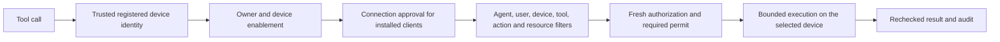

<!-- Copyright 2026 OLO Labs; SPDX-License-Identifier: Apache-2.0 -->
# Device registry and tool-call controls

This is the current reference for device registration, connection approval and
execution routing. It applies to installed client tools and Quickstart's fixed
server tools. A device record identifies the execution path; its presence,
installation, health indicator or deployment assignment never grants tool access.

## Registry flow

1. The installed protected service generates its own key and sends a signed CSR
   over direct HTTPS. Control creates a pending request, valid for ten minutes.
2. **Devices → Enroll device** lists pending requests automatically. An enabled,
   same-tenant human with `toolgate-enroller` reviews the public code and key
   fingerprint and chooses a connection duration before approving or denying.
3. Approval binds the key to that human's directory user. Control stores the
   directory device, owner, approval and audit atomically. Pending directory
   metadata, including a disabled record, cannot issue credentials.
4. The protected service retrieves its certificate using its private enrollment
   code, then reports ready tools and inventory. The browser never receives the
   device code, CSR private key, runtime bearer token or certificate credentials.
5. **Devices → Clients** combines registered devices and pending requests in one
   automatically refreshed table. Device name and registered user are visible
   columns alongside **System name** and **IP address**; each row has details available by hover, keyboard or the information
   button. Names can be edited through the directory editor.

Pending devices show **Awaiting registration** until an owner is established.
Installed clients show connected/offline state from authenticated check-ins;
the console uses a two-minute freshness window and does not treat approval alone
as a connection. The current client normally polls every 500 ms; older clients
retain their seconds-based interval.

System name is the protected client's reported OS hostname, separate from its
editable device name. Current clients send a bounded `X-ToolGate-System-Name`
header on authenticated HTTPS check-ins and WebSocket handshakes. Control records
the actual transport peer IP, ignoring forwarded-IP headers. These are display
metadata and never identity or authorization inputs. Missing metadata shows
**Not reported**; older clients need the current client build to report their name.
An observed IP may be a NAT/proxy address. Quickstart server-managed rows show
the composition host/container name and address.

## Approval and enablement

| Control | Meaning |
|---|---|
| Approve | Authorize the existing enrolled key until a chosen deadline or for unlimited time. Reapproval preserves the owner and directory enablement. |
| Deapprove | Temporarily remove connection approval while retaining the key, owner and reported state. |
| Enable / Disable | Independently control directory access. Enabling does not approve an enrolled key; approving does not reenable a disabled record. |
| Permanent API revocation | Retire the key permanently. Reapproval and certificate recovery cannot reactivate it. |

Installed-device access requires an active key, an enabled matching registered
owner, an enabled directory device and current connection approval. Pending
requests never satisfy these gates. Tool filters and grants still apply after
the device passes them.

Connection approval defaults to 24 hours. **Until a date and time** uses the
administrator's local time and stores an absolute UTC deadline.
**Unlimited time** explicitly stores approval with no access deadline; it does
not create a permanent certificate or bypass filters. Certificates remain valid
for at most 24 hours and renew. Finite approvals cap certificates and tool leases
at the deadline, rounded down to X.509 second precision.

Temporary disablement, deapproval or approval expiry returns HTTP **423** on
authenticated client access. The client retains its protected identity and retries
with bounded backoff. Unauthorized or permanently revoked identities continue to
receive authentication rejection. Job sockets recheck authorization on messages
and periodically; disabling a device is not permission to finish a new effect.

After an extended outage, the current client can use a verified CSR for the exact
already approved device/key to recover its public certificate. The server rechecks
owner, enablement and deadline and does not change the access grant. A different,
disabled, deapproved, expired-approval or permanently revoked key cannot recover.
Lost check-in responses retain sequence and effect replay protection; old replies
cannot reinstall an expired certificate or force a stale clock comparison.

## Uniform tool routing and filters

Control remains the registry authority. A caller cannot choose a device by adding
an untrusted request header or body field. Installed clients prove identity with
their actual TLS peer certificate; server adapters use composition-owned runtime
credentials bound to a fixed registered identity. Gateway normalizes arguments
and evaluates deterministic tool/action/resource and user/agent/device filters.
Unknown or unavailable identity, dependency, filter or permit fails closed.

Client calls use Gateway → Control's durable relay → the approved client. Discovery,
dispatch, authorization immediately before effects and result delivery all check
current registry and permission state. Local fixed tools use their registered
server device, current directory gates and fresh Gateway authorization before
each effect. HotFolder copy/move checks both paths. These shared device gates
do not replace resource confinement, ASK permits, package signatures or runtime
sandboxing. Standalone policy-only authorization APIs remain compatible; a policy
decision by itself cannot enroll a device or execute a client tool.

Quickstart registers these server-managed devices under **Local tool requester**:

| Device name | Identifier | Routing and control |
|---|---|---|
| Quickstart fixed executor | `local-builtins` | Fixed compute/server tools. Disabling it blocks all fixed server effects, including the HotFolder adapter. |
| HotFolder | `local-hotfolder` | Confined file tools. Authorization uses its own device-bound runtime credential so device-specific filters match this record. Disabling it leaves compute available. |
| REST call forwarding | `local-rest-forwarding` | The existing Gateway's forwarding of client tool calls, with registered-client permissions still checked downstream. Disabling it blocks discovery, dispatch and result delivery through that path. It is not an arbitrary external HTTP proxy. |

These are internal execution devices, not installed clients. They use server-managed
identity and need no human client enrollment, so Approve/Deapprove is not applicable.
They appear green while the Quickstart composition is ready and the device and
registered user are enabled. Unknown or failed readiness is never displayed green.
Readiness is availability, not a promise that a particular tool/filter will allow
an operation. Their runtime credentials still expire and rotate privately.

## Administrative API and concurrency

| API | Request or result |
|---|---|
| `GET /api/control/v1/endpoint/enrollments` | At most 32 unexpired pending reviews; enroller role and enabled same-tenant user. |
| `POST /api/control/v1/endpoint/enrollments/decision` | Reviewed user code, fingerprint, APPROVE/DENY and optional connection duration. |
| `GET /api/control/v1/endpoint/devices` | Bounded combined snapshot of directory devices, endpoint approvals, pending reviews, registered users and server-device metadata; admin role. |
| `POST /api/control/v1/endpoint/devices/{id}/approval` | `expectedApprovalRevision`, `approved`, optional `connectionExpiresAtUnixMs` or `unlimitedConnection`. |
| `POST /api/control/v1/endpoint/devices/{id}/enabled` | `expectedRevision` of the directory record and `enabled`; revision zero only for an unregistered, still-pending request. |
| `POST /api/control/v1/endpoint/devices/{id}/revoke` | Existing irreversible key-retirement API with endpoint `expectedRevision`. |

Use `Idempotency-Key` for each administrative mutation. Exact retries replay the
transactional result; changed payloads or stale revisions fail with 409. Approval
revision is separate from heartbeat/report revision, so a check-in cannot make an
approval decision stale. Legacy records without `connectionApproved` or
`approvalRevision` retain approval and revision one until administratively changed.

`unlimitedConnection: true` omits the access deadline. Sending it together with
`connectionExpiresAtUnixMs` on an approval is invalid. Omitting both retains the
24-hour default for older callers. Neither duration is inferred from the UI alone.

PostgreSQL migration V11 allows the new approve/deapprove, enable/disable and
identity-recovery audit events. Quickstart SQLite stores the same transactions
without a destructive state reset. Redeployment preserves existing identities,
owners, approvals, names and enablement and seeds only missing server records.
Existing policies explicitly scoped to `local-builtins` do not automatically
expand to `local-hotfolder`. Review and update the intended HotFolder device
scope after this routing change; default unscoped Quickstart policies keep working.

## Verification and troubleshooting

Boundary checks cover finite/unlimited decisions, stale revisions, idempotency,
same-tenant ownership, pending-device disablement, permanent revocation, deadline
expiry, certificate recovery and exact report replay on PostgreSQL and SQLite.
The composed smoke test proves HotFolder and fixed-executor gating independently,
REST forwarding disable/reenable, and installed-client disable/deapprove/reapprove
using real TLS, CSR and certificate authentication. UI checks cover pending and
approved rows, owner/name columns, accessible tooltips and unlimited forms.

For HTTP 423, inspect both device enablement and approval and its deadline. For
server tool denials also inspect the registered `local-tools` user and fixed
executor dependency. Keep the key and protected state; fix the registry or filter
that blocks access. Never relax TLS, owner binding, resource confinement or logging
redaction to work around a denied tool call.
