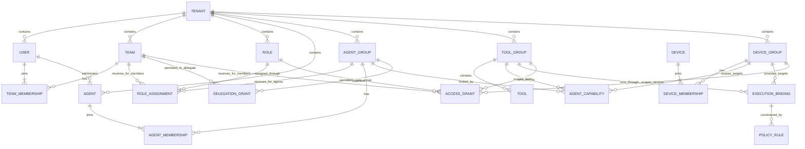
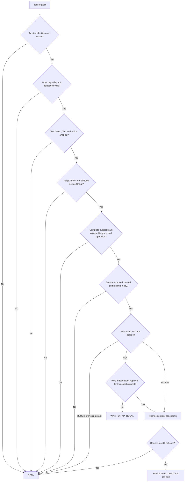

# Enterprise access control: tools, agents, people and devices

## Purpose

Define how ToolGate should combine **Tool Groups**, **Agent Groups**, **Teams**,
**Device Groups**, roles and policy to authorize enterprise discovery and execution.
The design must support individual access, departmental access, shared execution
devices, automation, temporary elevation and auditable revocation.

**Status:** target design, dated 8 October 2026. This document is not a claim that
every feature below is available. The published checkpoint is `0e5648f`. Agent
tool selectors, Device Group management and their enforcement are being developed
in the working tree. Tool Groups, scoped grant tuples, delegated identities and
the additional enterprise controls described here still require implementation.
See [the delivery plan](#delivery-plan-and-current-boundaries). Agent Group
membership and group-level actor permissions are also target features; the
current working mapping screen does not yet implement them.

The central rules are:

> A valid identity, group membership or agent tool mapping alone never authorizes
> execution. The effective principal, agent capability, tool, execution device,
> action, resource and request conditions must all satisfy the same request.

> Assign access through groups. Users, Agents, Tools and Devices have mandatory group
> membership, but no direct ACL, Role assignment or access-level link. Each
> grouping type has one protected tenant default so an individual never becomes
> orphaned. A newly observed verified human User starts disabled.

## Entity relationships

Groups organize different kinds of things. A Team contains people, an Agent Group
contains Agents, a Tool Group contains capabilities, and a Device Group contains
execution devices. None of
these memberships is itself an access grant.



Every Role Assignment targets one Team or one Agent Group, with an explicit
human/actor/management classification. Human grants come from Teams and their
Roles; actor capabilities and service grants come from Agent Groups and their
Roles. Their targets are Tool Groups and Device Groups. Runtime checks still name
the actual User, Agent, Tool and Device to verify membership and bind the exact effect.
Those identifiers are request facts and audit references, not direct ACL links.

| Entity | Relationship and responsibility |
|---|---|
| Tenant | Owns every identity, membership, role, group, binding, grant and policy. References and decisions never cross a tenant boundary. |
| User | Must belong to one or more Teams. Receives access only through Team membership and Team-assigned Roles. No direct Role or ACL assignment. Authentication and account enablement are separate from authorization. |
| Team | Contains zero or more Users. Carries shared Roles and explicit group grants for its enabled members. A Team does not double as a Device Group. |
| Role | A reusable bundle of scoped group rules. Human Roles are assigned to Teams; actor/service Roles are assigned to Agent Groups. A classification prevents using actor grants as human grants or vice versa. Management permissions remain separate from runtime capabilities. |
| Agent Group | Contains Agents and supplies group-scoped Tool capabilities, execution scope, service-mode grants and delegation policy. A human Team may delegate only to explicitly permitted Agent Groups. |
| Agent | A separately authenticated actor with an administrative owner and one-or-more Agent Group memberships. It inherits capability ceilings and allowed request modes through its groups; no direct runtime ACL or Role assignment. Ownership is not a delegation grant. |
| Tool Group | Contains zero or more Tools. Each Tool has exactly one primary Tool Group in the baseline design. Group grants can select Tools collectively, with action and resource limits. |
| Tool | Has a definition, supported actions, resource extraction rules and installation/runtime requirements. Belongs to one Tool Group and inherits its execution binding; no direct permission or Device Group assignment. Installation does not grant permission. |
| Device Group | Contains Devices. A Device can belong to one or more Device Groups. The group defines an authorization boundary for execution targets. |
| Device | Has a registered identity, approved key, enabled state and runtime inventory. Administrative ownership, device identity and the person requesting an operation are distinct concepts. |
| Execution Binding | Connects a Tool Group to an allowed Device Group. Member Tools inherit this execution boundary. |
| Access Grant | A complete permission tuple: Tool Group, actions, Device Group, resources and conditions. Human grants come from Teams/Human Roles; actor/service grants come from Agent Groups/Actor Roles. No grant directly references an individual User, Agent, Tool or Device. |
| Policy Rule | Applies ALLOW, ASK or BLOCK to the request. A policy can further narrow a grant; it cannot supply a missing identity, device trust or agent capability. |

### Cardinality and defaults

1. A User must join at least one Team and may join several. Roles are inherited
   from these Teams. An exceptional personal permission uses a dedicated Team,
   rather than a direct User grant.
2. A Device must belong to at least one Device Group. Every new Device joins
   `default-devices`; an administrator may later add groups or move it atomically.
3. A new Tool joins `default-tools` unless an administrator selects another Tool
   Group. This membership must not automatically permit discovery or execution.
4. For the target baseline, each Tool Group has **one explicit execution Device
   Group**. Each member Tool inherits that single-group dependency. Tools do not
   link directly to access grants or Device Groups. Separate Tool Groups are used
   where execution boundaries differ.
5. Access to a Tool Group does not itself grant access to its bound Device Group.
   Both dimensions must be covered by a complete applicable grant.
6. An enterprise extension may allow multiple Execution Bindings for a Tool Group.
   Every binding must be explicitly configured and authorized independently.
   Until that extension exists, use separate Tool Groups and their member Tools
   for separate execution scopes; do not infer extra bindings from overlapping
   Device membership.
7. The Tool Group's permitted execution groups are a mandatory ceiling. They
   grant no subject access, and a member Tool cannot enlarge or override them.
8. New memberships, new Roles and new Agents start without runtime grants.
   Empty grant or mapping selections mean **none**, never “all.” A privileged
   all-tools/all-devices selector must be explicit, tenant-scoped and audited.
9. Group nesting is excluded from the baseline. Future nesting requires bounded
   depth, cycle rejection and deterministic inheritance. Labels and tags may
   assist administration but must not create implicit grants.
10. Every Agent must belong to one or more Agent Groups and joins
    `default-agents` on creation. Agent credentials remain individual. Group
    membership must not pool credentials or erase which Agent performed an action.

### Default groups and orphan prevention

| Grouping type | Protected default | Mandatory membership |
|---|---|---|
| Human Users | Default Team, `team-default` | Every User, including disabled/pending Users, belongs to at least one Team. |
| Agents | Default Agent Group, `default-agents` | Every Agent belongs to at least one Agent Group. |
| Tools | Default Tool Group, `default-tools` | Every Tool belongs to exactly one primary Tool Group. |
| Devices | Default Device Group, `default-devices` | Every Device belongs to one or more Device Groups. |

“A default for every group” means a default for each **group type in each tenant**;
it does not mean a recursively nested default inside every custom group. Reuse
the configured existing default Team identifier during migration if it differs.
The default Tool Group is bound to the default Device Group in the baseline.

Creating or auto-registering an individual and assigning its default membership
must happen in one transaction. Moving an individual replaces/adds membership
atomically. Removing the last membership must either assign the corresponding
default in that same transaction or reject the mutation; it must never commit an
orphan. Deleting a custom group requires an explicit replacement group or a
reviewed transfer to default for its members. The UI must show inherited-access
impact before a transfer. Defaults themselves cannot be deleted or lose their
default designation without a validated replacement. The same rules apply to
Agent membership and Agent Group deletion.

Default membership is an organizational fallback, not a permission grant. The
default Team has no runtime or portal entitlement by default; the default Tool
Group has no audience by default; the default Agent Group has no Tool capability,
service grant or delegation permission; the default Device Group confers no
device-use permission by default. Disabled individuals retain valid membership
for inventory and review. Tenant creation provisions all four defaults before resources can
be registered. Imports, identity sync, enrollment, restore and bulk operations
must enforce these invariants too.

## Permission model

### Keep permissions as complete tuples

Use the following conceptual record; it is a design model, not a current API
payload:

```text
AccessGrant {
  tenantId, id, enabled, revision
  source: TEAM(teamId) | HUMAN_ROLE(roleId)
  toolGroupId
  actions: [read, write, deploy, ...]
  deviceGroupId
  resourceConstraint
  conditions
  validFrom, validUntil
}

AgentCapability {
  tenantId
  source: AGENT_GROUP(agentGroupId) | ACTOR_ROLE(roleId)
  toolGroupId
  actions
  deviceGroupId
  resourceConstraint
  permittedMode: DELEGATED | SERVICE
  validUntil
}

DelegationGrant {
  tenantId, teamId, agentGroupId
  toolGroupId, deviceGroupId, actions, resourceConstraint
  validUntil
}

ServiceGrant {
  tenantId
  source: AGENT_GROUP(agentGroupId) | ACTOR_ROLE(roleId)
  toolGroupId, deviceGroupId, actions, resourceConstraint
  verifiedWorkloadBinding, validUntil
}

ExecutionBinding {
  tenantId, toolGroupId, deviceGroupId
  enabled, allowedRuntimeOrPackage
}
```

A grant must cover the requested action, resource and the **Tool Group's bound
Device Group**. Access to another group containing the same Device is
insufficient. This prevents a Device's overlapping memberships from becoming
an unintended bridge between departmental or production boundaries.

Do not flatten permission rules into unrelated lists of Tool Groups and Device
Groups and then take their Cartesian product. For example:

| Existing grant | Allowed combination |
|---|---|
| Analyst Role | `finance-read` Tool Group, `read`, `finance-dev` Device Group |
| Production observer Role | `monitoring` Tool Group, `read`, `finance-prod` Device Group |

Combining these Roles must **not** authorize `finance-read` on `finance-prod`.
That combination needs its own complete grant. A Team's Device Group access
picker is an eligibility grant for that group; it must not manufacture a tool
execution tuple with unrelated grants. The policy or role rule must expressly
allow the requested Tool Group/Device Group combination.

### Resolve people, agents and service identities

| Request mode | Required principal checks |
|---|---|
| Human direct | Verified User identity, enabled account, effective scoped grants and matching policy. The reserved direct-human transport identity supplies no extra privilege. |
| Agent acting for a User | Verified User/delegation identity **and** verified Agent identity; effective User grants intersect the Agent capability, delegation limits and execution binding. |
| Unattended service Agent | Verified Agent plus an explicitly registered service principal and workload grants. No invented human user, borrowed administrator identity or implicit owner rights. |
| Agent chain | Each hop must be permitted; the effective scope cannot grow at a later hop. Record the requesting User, current Agent and verified delegation chain. |

Request `userId`, `agentId`, tenant and device identities must come from verified
credentials or a trusted server binding. Ordinary tool arguments must not select
a more privileged principal. A caller cannot gain another User's access by
changing a context field.

An Agent's owner manages its lifecycle; the owner is not necessarily the runtime
subject. Agent Groups must specify which Teams may delegate to their members.
An exceptional single-Agent permission uses a dedicated Agent Group, rather than
a direct Agent ACL. A Delegation Grant covers the complete Team/Agent Group/Tool
Group/Device Group operation; unrelated delegation and capability scopes cannot
be combined to invent a broader tuple.
Separate the client device initiating a request from the target execution Device.
The target's certificate proves Device identity, not the caller's human identity.

The target design follows the subject/actor separation described in
[RFC 8693](https://www.rfc-editor.org/rfc/rfc8693.html). Token exchange is one
possible implementation; referencing the RFC does not mean ToolGate currently
implements that protocol.

### Compose grants and ceilings

Eligible grants are the union of enabled, unexpired grants from enabled Teams
containing that User and from Roles assigned to those Teams. There are no direct
User grants or User-assigned Roles. Each rule retains its own Tool Group/Device
Group/action/resource scope.

Actor capabilities are the union of applicable complete rules from the enabled
Agent's enabled Agent Groups and their assigned Actor Roles. Human Role grants
and Actor Role grants are resolved separately. Multiple Agent Groups may supply
independent rules, but their action/resource/device scopes must not be flattened
or mixed. Disabling one Agent Group removes capabilities sourced from that group;
an independent complete capability from another group can remain. Disabling the
Agent itself blocks every group-derived capability.

For delegated execution:

```text
Effective capability =
  one complete applicable Team/Role grant
  INTERSECT one complete applicable Agent Group/Actor Role capability
  INTERSECT verified delegation to an eligible Agent Group
  INTERSECT Tool Group execution binding
  INTERSECT Tool/action/resource policy
  INTERSECT current device trust and request conditions
```

For service execution, substitute the explicit Agent Group/Actor Role service
grant and verified workload binding for human grants and delegation. A delegated
capability alone does not authorize service mode. For direct human execution,
omit only the delegation and Agent checks.
Every present actor contributes a ceiling; no actor can widen another's access.

For delegated calls, the Agent capability and Delegation Grant must reference the
**same enabled Agent Group** of the requesting Agent. Membership in Agent Group A
cannot satisfy a delegation restricted to A while borrowing a capability from
Agent Group B. A complete valid path through another group qualifies only when
that group also has its own matching delegation and capability. Resolve and audit
that path server-side; a caller's claimed group is not authoritative.

Portal Administrator or Super Admin classification must not by itself grant
runtime tool use. A dedicated emergency role can provide controlled runtime
elevation when needed. Managing an Agent, Device, Tool or group is a different
permission from executing a Tool.

## Decision procedure

### Discover available Tools

1. Verify tenant, subject identity, actor identity when present, and current
   enablement. Resolve trusted memberships and delegation context.
2. Consider only enabled Tool Groups, enabled Tools and supported actions within
   an enabled Agent Group capability or direct-human Team-derived scope.
3. Find at least one explicit execution binding with a trusted, enabled target
   in the bound Device Group and a complete applicable permission tuple.
4. Apply resource-independent ceilings, applicable BLOCK rules, time limits,
   environment requirements and installed runtime availability.
5. Return only eligible Tools. Where supported, expose allowed actions,
   eligible target scopes and whether execution requires approval.

If the request names a Device, discovery is restricted to that Device. Without a
target, discovering a Tool requires at least one eligible execution target; the
server resolves authorization again after a target is selected. Group access
must not reveal other groups' device inventory, tool schemas, internal paths or
secret metadata.

An ASK-eligible Tool may be discoverable with `requiresApproval=true`; execution
remains gated by the approval process. A discovery list is informational and must
never be accepted as an execution permit.

### Authorize execution



The binding Device Group must be selected explicitly. Authorization cannot
substitute another Device Group just because the same Device belongs to it.
Extract and normalize resources server-side using the Tool's reviewed extractor.
Validate the action against the Tool definition and bind the permit to the exact
argument digest, tenant, subject, Agent, Tool, Device and applicable approval.

Use a single decision implementation for discovery eligibility, Gateway
authorization, client dispatch and the check immediately before a protected
effect. These are different entry points with the same constraints. Recheck
queued requests before dispatch, permits before use and continuing work at
defined checkpoints. A result or retry must retain the original authorization
binding; a retry cannot change actor, target or arguments under the same key.

### Decision precedence and missing information

| Situation | Outcome |
|---|---|
| Invalid/missing identity, cross-tenant reference, unsupported action or missing required scope | DENY |
| Disabled required User, Agent, Agent Group capability/delegation path, Tool, Tool Group, Device or bound Device Group | DENY |
| Untrusted/unapproved Device, invalid package or unavailable required runtime | DENY or unavailable response; never execute |
| Any applicable enabled BLOCK rule | DENY, even if other rules ALLOW or ASK |
| Valid grant with applicable ASK requirement | ASK; matching ALLOW elsewhere must not bypass that requirement |
| All required ceilings and a complete ALLOW grant satisfied, no BLOCK or ASK requirement | ALLOW |
| Missing, expired or indeterminate authorization data | DENY |

Disabling a Team or Role removes grants inherited through it; other independent
valid grants may remain. Disabling the Tool's execution Device Group makes that
binding unusable for everyone. Device ownership changes, team removal and group
membership changes are security mutations and need explicit evaluation.

No numeric rule priority or display order may override a BLOCK. An approval can
satisfy a eligible ASK requirement, but it cannot override a missing group grant,
Agent capability, invalid device, expired delegation or explicit BLOCK.

## Worked enterprise example

| Object | Configuration |
|---|---|
| Users | Alice, Bob, Casey |
| Teams | Finance includes Alice; Platform Operations includes Bob; Audit includes Casey |
| Tool Groups | `finance-reporting`, `finance-payments`, `platform-operations` |
| Device Groups | `finance-dev`, `finance-prod`, `platform-prod` |
| Devices | Finance test client in `finance-dev`; finance production worker in `finance-prod`; shared maintenance worker in both `finance-prod` and `platform-prod` |
| Tools | `ledger.read` in `finance-reporting`, bound to `finance-prod`; `payment.release` in `finance-payments`, bound to `finance-prod`; `host.restart` in `platform-operations`, bound to `platform-prod` |
| Finance reader Role | `finance-reporting` + `read` + `finance-prod` + Finance-owned records |
| Payment operator Role | `finance-payments` + `release` + `finance-prod` + approved payment batch, ASK for independent review |
| Platform operator Role | `platform-operations` + approved maintenance actions + `platform-prod` |
| Agent Groups | `finance-assistants` permits finance reporting/read and Finance Team delegation; `platform-deployment` permits platform deployment in service mode |
| Finance assistant Agent | Member of `finance-assistants`; no direct Tool capability or Role assignment |
| Deployment service Agent | Member of `platform-deployment`; individually authenticated workload identity and approved artifacts, group-derived runtime scope |

Roles in this example are assigned to the named Teams. An exceptional additional
Role for Alice uses membership in a specifically scoped payment-operator Team,
never a direct User–Role link. Every Tool's Device Group binding is inherited
from its Tool Group.

Alice using the Finance assistant can read permitted ledger records on the
finance production worker. Alice cannot release payments through that Agent,
even if her Teams confer the Payment operator Role: the Agent's capability does not
include payment release. A separately permitted payment Agent still needs Alice's
payment grant and the independent approval.

Bob can restart the shared maintenance worker through its `platform-prod`
binding when policy allows. Its simultaneous membership in `finance-prod` gives
Bob no right to call `ledger.read` or `payment.release`. Casey can receive a
read-only audit grant without device administration or payment execution.

## Use-case catalogue

These scenarios specify expected behavior and acceptance coverage. Future
capabilities are explicitly identified in the delivery plan; the table does not
imply they already ship.

### People, Teams and Roles

| # | Use case | Required result |
|---|---|---|
| 1 | Give one User one read Tool | Put the User in a dedicated Team and the Tool in a scoped Tool Group; a complete group grant permits only the action/resource/bound group. |
| 2 | Add a new Finance employee | Team membership inherits Finance grants only after identity/account activation. |
| 3 | User joins Finance and IT Teams | Union valid complete rules; no cross-product of one Team's tools and the other's devices. |
| 4 | Assign one Role to several Teams | The same bounded rule set applies to enabled members; team membership remains separate. |
| 5 | User inherits Roles from several Teams | Resolve complete rules with provenance; applicable BLOCK still wins. |
| 6 | Remove a User from a Team | Remove that Team's grants and delegations; independent grants from other Teams remain visible, and last-membership removal cannot orphan the User. |
| 7 | Disable a Team or Role | Stop inherited grants without deleting memberships or audit history. |
| 8 | Give a contractor limited access | Explicit expiry, allowed resources and Device Groups; expiry denies without manual cleanup. |
| 9 | Auditor inspects configuration | Read-only management scope; no implied runtime execution or secret access. |
| 10 | Administrator manages devices but cannot run payment Tools | Management permission and tool-use grants remain independent. |
| 11 | Team grants read while Role grants write | Each action requires its own applicable tuple; read does not imply write. |
| 12 | Conflicting grant and explicit denial | Applicable BLOCK denies across all sources; explanation identifies the denial safely. |

### Tools, Tool Groups and execution bindings

| # | Use case | Required result |
|---|---|---|
| 13 | Grant a Tool Group containing many Tools | Include only enabled members within granted actions, resources and bound device scope. |
| 14 | Newly published Tool enters a privileged Tool Group | Start in default-tools; show inherited-access impact before reviewed movement into the privileged group. |
| 15 | Tool moves from reporting to payment group | Recompute affected discovery, grants and Agent capabilities; no stale group-derived rights. |
| 16 | Isolate one dangerous Tool | Move it to a restricted Tool Group, or disable it pending review; do not attach a direct ACL to the Tool. |
| 17 | Tools require different execution Device Groups | Place them in separate Tool Groups with explicit bindings; no per-Tool override. |
| 18 | Tool requires multiple actions such as read and delete | Return allowed actions; only explicitly permitted actions execute. |
| 19 | Tool receives a resource outside the allowed folder/account/project | Server extraction and canonical resource matching deny it before the effect. |
| 20 | Installed client advertises an unregistered Tool | Installation inventory cannot create a Tool grant or trusted definition. |
| 21 | Approved Tool version changes | Review definition/extractor changes and runtime assignment; stale/incompatible permits fail. |
| 22 | Tool is disabled or its group is disabled | Remove discovery and deny queued or new executions using that binding. |

### Devices and Device Groups

| # | Use case | Required result |
|---|---|---|
| 23 | New Device enrolls | Join `default-devices`; still require identity review, enablement, approval and runtime grants. |
| 24 | Administrator moves Device into Production | Atomic membership change, revision check, audit and impact preview; no membership-free intermediate state. |
| 25 | Device belongs to two departmental groups | A Tool requires access to its bound group; the other membership cannot substitute. |
| 26 | User accesses a shared department Device | Target trust and caller identity are checked separately; group grants do not impersonate the Device owner. |
| 27 | User can access a Device Group but no Tool Group | No Tools become executable from device eligibility alone. |
| 28 | User can access a Tool Group but not its Device Group | Bound Tools are hidden or denied in that target context. |
| 29 | Tool executes on a shared server rather than caller's laptop | Evaluate the execution Device; apply separate caller-device posture if policy requires it. |
| 30 | Remove Device from the Tool's group while a job waits | Recheck binding before dispatch/effect; deny the queued request. |
| 31 | Device key is revoked, approval expires or owner account is disabled | Fail the live trust/registry gate regardless of cached policy or green availability. |
| 32 | Last group membership is removed | Reject mutation; default membership may be replaced only with at least one other group. |
| 33 | Disable a Device Group | All execution bindings requiring it stop granting; another enabled membership does not revive them. |
| 34 | Target is offline or Tool runtime is absent | Report unavailable safely; do not silently reroute to an unapproved Device. |

### Agents, delegation and automation

| # | Use case | Required result |
|---|---|---|
| 35 | Agent can use Tool but User cannot | Deny delegated execution. |
| 36 | User can use Tool but Agent cannot | Hide/deny in that Agent context; authorized direct use may still be permitted. |
| 37 | Agent Groups supply no applicable capabilities | Discover no Tools and execute none; default membership does not supply a grant. |
| 38 | Agent needs all safe reporting Tools but no payment Tool | Map only the reporting Tool Group; payment Tools belong to a separate restricted group. |
| 39 | Team shares an assistant | Require allowed delegation from the requesting User/Team; evaluate that User's grants. |
| 40 | Agent owner is a Super Admin | Ownership supplies no additional runtime rights to the Agent or its delegated Users. |
| 41 | Scheduled automation has no human present | Use explicit service/workload identity and grants; retain actor attribution. |
| 42 | Agent attempts to change userId or tenantId | Reject untrusted identity changes before policy evaluation. |
| 43 | Agent delegates to another Agent | Verified, bounded chain; downstream scope cannot exceed any upstream ceiling. |
| 44 | Agent credential expires or mapping is revoked mid-workflow | Recheck subsequent protected effects; already completed effects remain audited. |
| 45 | Retry changes target or arguments under the same request key | Reject conflicting replay; an identical retry cannot duplicate the protected effect. |

### Approvals, conditional access and operations

| # | Use case | Required result |
|---|---|---|
| 46 | Payment/deployment requires independent approval | ASK binds reviewer, subject, actor, target, action, resource, arguments and expiry; no self-approval. |
| 47 | User or Agent loses required grant after approval | Approval cannot revive the revoked capability; deny before effect. |
| 48 | Temporary incident elevation | Explicit role/grant with incident reference, expiry and bounded targets; record activation and expiry. |
| 49 | Break-glass recovery | Dedicated emergency workflow, signed authority, narrow time window, strong review/audit; no general Super Admin bypass. |
| 50 | Require corporate network, device posture or business hours | Trusted contextual attributes must satisfy policy; missing or stale evidence fails closed. |
| 51 | Region/data-residency restriction | Binding plus trusted location attributes keeps execution/data within allowed scopes. |
| 52 | High-value payment or unusual invocation rate | Trusted argument extraction and approved thresholds add ASK/BLOCK or bounded limits. |
| 53 | Maker/checker separation of duties | Requester cannot approve their own request; policy/role authoring and publication may require separate administrators. |
| 54 | Bulk disable during an incident | Invalidate applicable live grants, queue dispatch and fresh permits; expose rollout/adoption state. |
| 55 | Two administrators edit a mapping concurrently | Revision conflict prevents lost updates; reload and review before another mutation. |
| 56 | Tenant A names Tenant B's Tool/Device/User | Reject without revealing the other tenant's inventory. |
| 57 | Gateway/Control outage or stale signed policy | Follow bounded freshness rules; unavailable or expired authority never permits new protected effects. |
| 58 | Offline client requests execution | Default deny for enterprise operations requiring live authorization; any future offline capability needs explicit narrow leases and a declared revocation bound. |
| 59 | Permission removed during a long-running operation | Recheck at protected checkpoints; stop remaining effects where safe and audit partial completion. |
| 60 | Restore backup or roll back policy | Never reset identity revisions or replay old permits; publish a new monotonic version and evaluate current membership/trust. |
| 61 | Access review finds dormant grants | Show source and affected operations; revoke with audit and validate resulting effective access. |
| 62 | Dry-run policy against a production request | Return decision/reason/provenance with no effect, no approval consumption and no secret disclosure. |
| 63 | Nested groups or dynamic identity-provider Teams are introduced | Explicit supported rules, trusted synchronization and cycle/depth limits; no inferred or stale membership expansion. |
| 64 | Orphaned owner, deleted group or retired identifier | Preserve history, reject dangling active references and prevent identifier reuse from reviving access. |
| 65 | First access by a verified unknown human identity | Register exactly one disabled User, assign default Team, show it in Users and deny the attempted resource access. |
| 66 | Administrator enables a pending User | Explicit audited enablement; runtime/portal access still depends on that User's Team grants and Roles. |
| 67 | Previously disabled User tries again | Update bounded attempt metadata; never automatically enable or create a duplicate identity. |
| 68 | Unauthenticated caller supplies a fake User identity | Reject authentication; log a safe failed-authentication event without manufacturing a registered User. |
| 69 | Tool or User loses its last group during deletion/import | Reject or atomically transfer to the corresponding default; no ungrouped committed entity. |
| 70 | Same verified identity reaches several Gateways concurrently | Stable issuer/subject/tenant binding and uniqueness produce one disabled User and one valid default membership. |
| 71 | New Agent is registered | Assign default-agents atomically; no direct capabilities, no inherited runtime access from default membership. |
| 72 | Agent joins an authorized Agent Group | Inherit only complete group capabilities and compatible Actor Roles; existing individual credentials remain distinct. |
| 73 | Agent belongs to several Agent Groups | Union complete rules without mixing one group's Tool scope with another's Device Group or delegation scope. |
| 74 | Team can delegate to Agent Group A, Agent has a capability only through B | Deny that path; the capability and delegation must agree on the same enabled Agent Group. |
| 75 | Agent Group is disabled or Agent leaves it | Remove that group's capabilities and recheck queued/new effects; independent valid group paths may remain. |
| 76 | Agent loses its last group or its custom group is deleted | Reject or atomically move to default-agents; never commit an orphan or retain the removed group's grants. |
| 77 | One Agent needs exceptional restricted capabilities | Create a dedicated scoped Agent Group and assign membership; never create a direct Agent ACL. |
| 78 | Group permits delegated operations but not unattended automation | Service-mode requests remain denied until an explicit service grant and verified workload binding exist. |
| 79 | Several Agents share a group | Group permissions are shared, credentials are individual, and audit identifies the actual requesting Agent. |
| 80 | Administrator opens the Agents menu | Agent inventory and group mappings are managed under their own menu; no direct permission editors appear on individual details. |

## First-access registration and administrator enablement

Any verified **human** identity attempting to access a ToolGate resource must
be represented in the tenant's User inventory, even when access is rejected.
Automatically enrolling a User into the inventory does not approve the request.

```mermaid
sequenceDiagram
    participant U as Human user
    participant G as Gateway or Control
    participant I as Identity directory
    participant A as Administrator
    U->>G: Access attempt with trusted identity
    G->>G: Verify issuer, subject, audience and tenant
    G->>I: Resolve stable identity binding
    alt First verified human access
        I->>I: Create disabled User and default Team membership atomically
        I->>I: Record first and latest attempt metadata
        G-->>U: Access denied; account awaits administrator enablement
        A->>I: Review User and trusted identity details
        A->>I: Assign reviewed Team membership and enable User
        I->>I: Commit revision, activation and audit
    else Known disabled human
        I->>I: Update bounded latest-attempt metadata
        G-->>U: Access denied; disabled account
    else Known enabled human
        G->>G: Evaluate group grants, actor, target and policy
        G-->>U: Allow, ask or deny the requested operation
    end
```

Registration must use a stable `(tenant, trusted issuer, subject)` binding. An
email address or display name may be a label but must not be the authorization
identity: labels can change and different issuers can reuse them. Use an internal
identifier plus an immutable external-identity binding, with uniqueness and
idempotent handling of concurrent attempts. User-selected context fields or
unsigned identity headers cannot create or enable a User.

For an unknown verified human, commit a disabled inventory record and default
Team membership, then reject the request. A subsequent denial must not roll back
the registration. Update safe, bounded attempt metadata on later attempts; do
not repeatedly create records. Previously disabled or rejected Users remain
disabled. Identity-provider group synchronization may supply trusted Team
membership, but it cannot independently enable a new User or bypass review.

The Users screen must list enabled and disabled records, with filters for
**Pending/disabled**, first-seen time, last-attempt time, trusted identity source,
default/current Teams and registration reason. Administrators need explicit
**Enable** and **Disable** actions and a review view. Enablement must be
revision-checked and audited; it must not issue a credential, approve a Device,
grant a Role directly, approve an operation or replay the rejected request.
The User retries after enablement and the complete authorization checks run.

Administrative access to this screen needs an existing trusted recovery/admin
identity; a newly registered User cannot enable itself. Disabling a User blocks
subsequent human and delegated operations even if Team permissions remain.
Service Agents and Device credentials are handled in their own inventories and
must not fabricate human Users. Platform-managed execution identities need an
explicit documented identity classification during migration.

Requests with invalid or missing authentication are failed-authentication events,
not verified Users. Bound intake rate, storage and tenant resolution so arbitrary
internet requests cannot flood the User directory. If intake persistence is
unavailable, deny access and report the intake failure; never authorize an
unlisted human. Do not store submitted passwords, tokens or sensitive arguments
in the User's attempt metadata.

## Management screens and workflows

### Left navigation

Agents have their own top-level menu, separate from Users and Devices.

| Left menu | Target child screens |
|---|---|
| Audit | Audit log, operation approvals, authorization history |
| Tools | Tools, Tool Groups, Policies, Tool builder, built-in tools/vault, client tool requests |
| Devices | Clients/Devices, Device Groups, enrollment, packages |
| Users | Users, Teams, Human/Management Roles, human access review |
| Agents | Agents, Agent Groups, Actor/Service Roles, group access mappings, delegation, credential lifecycle, agent access review |

The Agent directory manages identity, owner, enablement and mandatory membership.
The **Agent Group access mappings** screen manages permissions. An individual
Agent detail page may show read-only effective access and links to its groups;
it must not offer a direct permission or Role assignment editor. Apply the same
distinction to User, Tool and Device detail pages.

The working navigation now separates Agents and the existing mapping screen;
the future Agent Group and delegation screens require the canonical group model
before they can be offered as working routes.

| Screen | Required capabilities |
|---|---|
| Tool Groups | Create/rename/disable; display Tools, permitted execution-group ceiling, grants and inherited-access impact. |
| Tools | Select mandatory Tool Group; display inherited execution Device Group; edit supported actions/definition; inspect runtime and group-derived access. No direct access assignment. |
| Agent Groups | Create/rename/disable; manage mandatory Agent membership, inherited Actor Roles, allowed delegation Teams and service/delegated modes. Protect the default and the last membership. |
| Tool–Agent mapping | Select an Agent Group and map Tool Groups with complete action/resource/Device Group ceilings; inspect member Agents and effective access. Empty means deny. No individual Agent or Tool ACL. |
| Teams | Select Users, assigned Roles and scoped grants; inspect inherited access before changing membership. |
| Users | List every verified access-attempt identity, including newly disabled Users; show first/last attempt, trusted source and Team-derived access. Review and Enable/Disable; assign mandatory Teams only. No direct Role or permission editor. |
| Roles | Build separate permission tuples with Tool Group, actions, Device Group, resources and conditions; assign through Teams; manage fixed templates independently of portal classification. |
| Device Groups | Create/rename/disable; manage Device membership, eligible subjects and Tools bound to the group; protect last membership. |
| Devices | Show key/approval/enablement/runtime state and one-or-more groups; update membership atomically; distinguish unavailable targets from denied access. |
| Agent identities | Manage owner, authentication, rotation, service/delegated mode and allowed delegators; never expose raw credentials in listings. |
| Policies | Add ALLOW/ASK/BLOCK with explicit selectors; preview conflicts and fully resolved scope; avoid empty-list wildcard behavior. |
| Effective access explorer | Select User/service principal, Agent, Tool/action, target Device and resource; explain ALLOW/ASK/DENY and grant provenance. |
| Approvals | Independent review, exact request binding, expiry and revocation; separate connection approval from operation approval. |
| Access review | List who can use which Tool/action on which group, source, expiry, unused grants and disabled/dangling dependencies. |
| Publication and audit | Review diff/impact, publish monotonic policy, observe Gateway/client adoption and inspect redacted authorization history. |

A group's “Access” tab presents Team/Role assignments and resolved effective
Users for inspection. It must write the same canonical scoped grants used by
Team/Role editors, and must never create a direct individual ACL. Avoid a second
independent ACL system with different precedence.

Routine administrators may manage scoped memberships within delegated bounds.
Role creation, assignment of privileged grants, production-group movement,
Agent Group membership/capability/delegation changes,
enabling emergency access and changes to administrative scope require dedicated
management permissions. A principal cannot grant rights outside its own
administrative delegation. Preserve the last enabled recovery administrator.

## Lifecycle, distribution and audit

### Change and publication

All graph mutations must be tenant-isolated, schema-validated, referentially
validated, revision-checked and audited in the same transaction. Exact retries
use idempotency keys. Membership transfer updates all affected groups atomically.
Deletion cannot leave an active Tool binding or principal grant referencing a
missing group; disabling preserves history but removes the applicable grant.

Show configuration saved, policy published and enforcement adopted as distinct
states. Signed policy compilation must retain complete scoped tuples and BLOCK
precedence; an empty resolved dimension must produce no allow rule. Do not encode
an empty resolved grant as a runtime wildcard.

Gateway enforcement uses a verified bounded-lifetime snapshot. Client relay
dispatch and protected-effect checks must also consider current registry,
membership and grant state. A deployment must define its maximum stale-access
window and expose the last adopted revision. A published change cannot claim
instant revocation on a disconnected node. For production operations requiring
immediate revocation, require a fresh online authorization check before effect;
if that authority is unavailable, deny or defer the operation.

### Approval and permit lifecycle

Approval and execution permits must have separate lifetimes. Approval records
bind the reviewed request. Execution permits are short-lived, audience-bound,
single-use where applicable, and tied to the current subject/actor/target plus
argument digest. Expired, replayed, changed or mismatched permits fail. An
authorization rejection must not consume or execute a different request.

ToolGate connection approval verifies a client may connect; it does not authorize
arbitrary Tools. Device enrollment, package assignment, installed runtime state,
Tool discovery, operation approval and execution permission remain separate gates.

### Audit requirements

Record timestamp, tenant, requesting subject, service principal when relevant,
current Agent and delegation chain, Tool/Tool Group, action, target Device and
bound Device Group, normalized resource identifier or redacted digest, decision,
reason category, grant/policy provenance, configuration/policy revision, approval
reference and request/argument digests.

Administrative audit must capture membership/grant changes, approver and publisher
identities, expiry, revision and impact. Do not place raw credentials, secret
arguments or unredacted sensitive Tool output in ordinary authorization logs.
Expose detailed denial explanations only to authorized administrators; runtime
callers receive enough information to resolve their request without learning
other departments' inventory or grants.

## Data and API design

Prefer explicit association records for Team membership, Role assignment, Device
membership, Agent capabilities and scoped grants. This allows per-edge expiry,
provenance and concurrency control without treating display labels as identities.

All records and references include tenant scope. Use foreign keys or equivalent
transactional graph validation, unique active membership edges, immutable retired
identifiers and monotonically increasing revisions. A Role Assignment targets a
Team or Agent Group with a compatible Human/Actor/Management Role type. Human
grant sources are Teams/Human Roles; actor/service sources are Agent Groups/Actor
Roles. Reject direct User–Role, Agent–Role and individual User/Agent/Tool/Device
permission associations in the target canonical contracts.
Group identifiers are stable even when names change. Mandatory membership is
validated inside the mutation transaction rather than repaired asynchronously.

Publish canonical contract definitions and generated bindings before adding APIs.
Existing arrays can support the first UI iteration, but an enterprise grant must
be a **list of complete rules**, rather than independent `toolIds` and
`deviceGroupIds` arrays that lose pairwise scope.

Proposed additions, subject to canonical API design:

```text
/api/control/v1/tool-groups
/api/control/v1/tool-groups/{id}
/api/control/v1/agent-groups
/api/control/v1/agent-groups/{id}
/api/control/v1/agents/{id}/groups
/api/control/v1/device-groups
/api/control/v1/device-groups/{id}
/api/control/v1/devices/{id}/groups
/api/control/v1/access-grants
/api/control/v1/agent-groups/{id}/capabilities
/api/control/v1/agent-groups/{id}/delegations
/api/control/v1/effective-access/evaluate
/api/control/v1/access-reviews
/api/control/v1/users/{id}/activation
```

List and explain endpoints require inventory/inspection permission and bounded
pagination. Mutations require management permission, revision guards and exact
retry keys. An effective-access simulator must use the same decision logic as
execution but must not issue a permit, perform an effect or spend an approval.

## Delivery plan and current boundaries

| Stage | Scope and acceptance boundary |
|---|---|
| Published checkpoint | Existing directory, managed Roles, policy publication, device registry/approval and client relay. Last pushed commit: `0e5648f`. |
| Current working changes | Agent allowed-Tool mapping; distinct Device Groups; default new-device membership; User/Team/Role group selection; one Device Group per Tool; atomic membership API and UI; policy/relay narrowing. These changes still require full verification and publication. |
| Group-only foundation | Provision default Team, Agent Group, Tool Group and Device Group per tenant; enforce mandatory membership for every User/Agent/Tool/Device. Move the working Tool-to-Device binding onto Tool Group and Agent capabilities onto Agent Group; remove direct individual permission assignments through a reviewed compatibility migration. |
| First-access intake | Verified human identity intake creates a disabled User and default Team membership, records bounded attempt metadata, and rejects access. Users UI provides review and explicit administrator Enable/Disable. |
| Tool Group management | Canonical Tool Group entity, required Tool membership, Tool Group UI, group-to-group execution bindings, scoped policy/Agent selectors and group-change impact. No group membership may grant access automatically. |
| Agent Group foundation | Canonical Agent Group entity, atomic membership, default/last-membership protection, group-level Tool mapping, Actor Roles and Team-to-Agent Group delegation. |
| Enterprise scoped grants | Complete human and actor/service group permission tuples, group-only Role assignment, effective-access explorer, expiry, provenance and delegated management. Explicitly avoid flattening unrelated scopes. |
| Shared-device and identity work | Separate registered Device owner from requesting subject; verified User–Agent delegation, service principals and bounded Agent chains. Update authenticated relay contracts and enforce every actor before offering shared execution. |
| Conditional access and governance | Trusted attributes, JIT grants, independent approvals, emergency access, separation of duties, access reviews and bounded revocation. |
| Optional extension | Multiple explicit Tool Group execution bindings and bounded group nesting after the single-binding model is tested and migration behavior is defined. |

Current compatibility boundaries must not be mistaken for the target design:

- Retained Agents without explicit `allowedToolIds` use legacy policy scoping;
  an explicit empty mapping denies all Tools. Migration must convert retained
  mappings into reviewed Agent Group capabilities before claiming uniform
  enterprise behavior. Per-Agent allowedToolIds are a working compatibility
  design, not the target source of permissions.
- Retained Tools without `deviceGroupId` use the default group when available;
  older synthetic directories have compatibility behavior. New managed Tools
  in the working implementation save a direct binding. The target design moves
  that binding onto Tool Group. Tool Group is not yet a canonical entity.
- Current User records can hold direct Role and Device Group selections. The
  target design removes those assignments: preserve the intended access through
  reviewed Team membership and complete Team/Role group grants. The existing
  selectors must not be described as the finished group-only model.
- Legacy Role profiles used Teams as Device Groups. Retained references need a
  controlled migration to real Device Groups; new associations must keep the
  entity types separate.
- Legacy administrative profiles and unbound external bootstrap identities have
  compatibility paths. The target enterprise model requires explicit runtime
  grants and explicit service/delegation identity, with a migration that does
  not unexpectedly remove recovery access or silently broaden runtime access.
- The current installed-client relay binds runtime context to the registered
  owner. A Device Group selector alone does not implement shared-device callers
  or arbitrary cross-owner execution.
- Current role scope arrays, current publication behavior and current policy
  ASK handling are not a substitute for the complete tuple/conditional policy
  model described here.

Migration should inventory and explain existing effective permissions first,
create all defaults, backfill mandatory membership and reviewed group bindings,
translate direct legacy grants to explicit Teams, preserve identities/audit
history, preview the before/after decisions, then publish a monotonic replacement
policy. New identifiers must not resurrect retired grants. Legacy behavior needs
an explicit documented transition boundary rather than a permanent invisible
bypass.

## Verification plan

Turn each use-case row into a decision or integration acceptance case as its
stage is implemented. At minimum, verify:

1. Every authorization dimension can independently change ALLOW into DENY:
   subject, Team, Role, Agent map, delegation, Tool Group, Tool, bound Device
   Group, membership, device trust, action, resource, expiry and environment.
2. Overlapping Device Groups cannot authorize the wrong binding. Permissions
   from unrelated Roles/Teams cannot create a new Tool/Device combination.
3. Direct, inherited, service and delegated requests use the same core decision
   rules. Empty, disabled, expired, missing and cross-tenant scope fail closed.
4. Discovery is a subset of current execution eligibility, with an explicit ASK
   distinction; knowing a Tool identifier does not bypass execution checks.
5. BLOCK survives group/Agent narrowing, approvals and emergency workflows.
6. Queue submission, dispatch, pre-effect authorization and result retrieval
   retain the original subject/actor/target and recheck current access.
7. Membership/grant mutations are atomic, audited, idempotent and reject stale
   revisions; snapshots preserve complete relations and retained-state upgrades.
8. Published/adopted versions cannot move backward; stale or unavailable
   authorization cannot execute outside the declared freshness boundary.
9. Shared execution never substitutes Device-owner credentials for the caller.
   Agent ownership never supplies an unapproved delegation or runtime grant.
10. Approval requests, permits and retries are exactly bound and bounded; no
    self-approval, replay or argument/target substitution.
11. Browser workflows show inherited-access impact, saving/conflict/error states
    and activation status, with keyboard-accessible selectors and bounded pages.
12. Audit and effective-access explanations identify the decision source without
    exposing credentials, sensitive arguments or unauthorized inventory.
13. All creation/import/sync/enrollment/deletion paths retain mandatory group
    membership; protected defaults cannot be removed or silently grant access.
14. First verified human access creates one disabled User despite concurrent
    attempts. Unknown/disabled Users remain denied until explicit administrator
    enablement; enablement still requires Team-derived authorization afterward.
15. No new canonical ACL or Role assignment directly targets a User, Agent, Tool
    or Device; administrative ownership and audit bindings do not become grants.
16. Agent Group membership, delegation and capabilities form the same complete
    group path. Different Agent Groups cannot contribute mismatched parts of an
    allow; group removal/disablement is rechecked before the next effect.

## Related documentation and design references

- [Device registry and tool-call controls](../control-plane/device-registry.md)
- [Managed Roles](../development/managed-roles.md)
- [User roles and fixed templates](user-roles.md)
- [Signed policy bundles](../control-plane/policy-bundles.md)
- [ASK approvals](../adr/006-ask-approvals.md)
- [Security invariants](security-invariants.md)
- [Admin console](../control-plane/admin-ui.md)
- [NIST SP 800-162: ABAC](https://csrc.nist.gov/pubs/sp/800/162/upd2/final)
  provides the subject, object, operation and environment framework used to
  organize contextual checks. The entity/cardinality and permission composition
  choices in this document are ToolGate design proposals, not NIST mandates.
- [RFC 8693: OAuth Token Exchange](https://www.rfc-editor.org/rfc/rfc8693.html)
  describes representing a requesting subject and delegated actor distinctly.

Next implementation reference: introduce Tool Groups, Agent Groups and complete grant tuples
in the canonical contracts, then reuse the same evaluator across all enforcement
entry points before expanding enterprise management screens.
